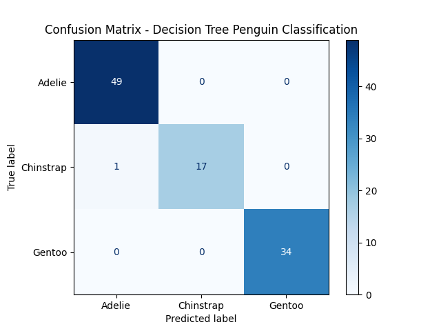
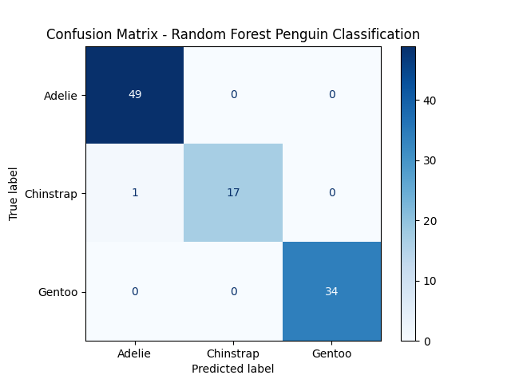

# Random Forest Penguin Classification Project

## Project Overview

This project aims to build classification models to identify penguin species based on physical measurements from the Palmer Penguins dataset. It supports both Random Forest and Decision Tree classifiers, allowing for comparison between ensemble and interpretable single-tree approaches.

### Contents

- Data Description
- Data Preprocessing
- Modular Project Structure
- Machine Learning Workflow
- Classifier Options
- Model Performance
- Visualization
- Installation and Requirements

## Data Description

The dataset includes the following features:

- **species**: Target variable representing the penguin species (Adelie, Gentoo, Chinstrap)
- **island**: The island the penguin inhabits (Biscoe, Dream, Torgersen)
- **culmen_length_mm**: Culmen length in millimeters
- **culmen_depth_mm**: Culmen depth in millimeters
- **flipper_length_mm**: Flipper length in millimeters
- **body_mass_g**: Body mass in grams
- **sex**: Gender of the penguin

## Data Preprocessing

- Missing values are removed.
- Categorical variables `island` and `sex` are converted to numerical features using one-hot encoding.
- Original data files remain unchanged; preprocessing is handled in a dedicated function within the `one_hot_encoder.py` module.

### Original data:

|species|island|culmen_length_mm|culmen_depth_mm|flipper_length_mm|body_mass_g|sex|
|--|--|--|--|--|--|--|
|Adelie|Torgersen|39.1|18.7|181.0|3750.0|MALE|
|Adelie|Torgersen|39.5|17.4|186.0|3800.0|FEMALE|
|Adelie|Torgersen|40.3|18.0|195.0|3250.0|FEMALE|
|Adelie|Torgersen|NaN|NaN|NaN|NaN|NaN|
|Adelie|Torgersen|36.7|19.3|193.0|3450.0|FEMALE|

### Cleaned and encoded data:

#### Feature table:

|Index|culmen_length_mm|culmen_depth_mm|flipper_length_mm|body_mass_g|island_Biscoe|island_Dream|island_Torgersen|sex_.|sex_FEMALE|sex_MALE|
|--|--|--|--|--|--|--|--|--|--|--|
|0|39.1|18.7|181.0|3750.0|False|False|True|False|False|True|
|1|39.5|17.4|186.0|3800.0|False|False|True|False|True|False|
|2|40.3|18.0|195.0|3250.0|False|False|True|False|True|False|
|4|36.7|19.3|193.0|3450.0|False|False|True|False|True|False|
|5|39.3|20.6|190.0|3650.0|False|False|True|False|False|True|

#### Target table:

|Index|species|
|--|--|
|0|Adelie|
|1|Adelie|
|2|Adelie|
|4|Adelie|
|5|Adelie|

## Modular Project Structure

- `one_hot_encoder.py`: Contains the `preprocess_penguin_data(filepath)` function which loads, cleans, and encodes the dataset.
- `data_inspector.py`: Loads the processed data using the encoder and provides utilities for data inspection (e.g., displaying the first rows).
- `random_forest.py`: Implements model training, prediction, evaluation, and visualization using Random Forest.
- `decision_tree.py`: Implements model training, prediction, evaluation, and visualization using Decision Tree.

## Machine Learning Workflow

1. Load and preprocess data using `preprocess_penguin_data`.
2. Split data into training and testing sets.
3. Train a classifier (Random Forest or Decision Tree) using the dedicated script.
4. Predict on test data.
5. Evaluate performance using accuracy, precision, recall, F1-score, and visualize results with a confusion matrix.

## Classifier Options

- Random Forest (`random_forest.py`): An ensemble method that improves predictive accuracy and robustness.
- Decision Tree (`decision_tree.py`) : A simple, interpretable model using a single tree structure.

Both classifiers are supported; select which to train and evaluate by running the corresponding script.

## Model Performance

- Random Forest achieves high accuracy (~99%).
- Decision Tree offers interpretable results with slightly lower accuracy.
- Balanced classification performance across penguin species in both models.

## Visualization

Confusion matrix visualization using `sklearn.metrics.ConfusionMatrixDisplay` to show true vs. predicted classifications.

## Installation and Requirements

- Python 3.12.4 (recommended)

Required Python libraries (installation via pip):

- pandas
- numpy
- scikit-learn
- matplotlib

---
## How to setup the Modell
1. Create an Virtual Env

``
python -3.12 -m venv venv
``

2. Activate venv

``
.\venv\Scripts\activate
``

3. Install required packages

``
pip install -r requirements.txt
``

4. Start Streamlit-App

``
streamlit run .\Live_Demo.py
``

## Contributors

- Bendix Greiner
- Maurice Baumann
- Pascal Grimm
